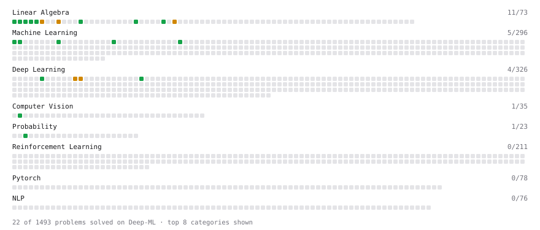

# Deep-ML

My machine learning practice from [Deep-ML](https://www.deep-ml.com). Every solution here was written by hand.

**82** solved · 74 problems · 0 labs · 8 math

[**Browse the interactive portfolio**](https://amitrai12018.github.io/deep-ml/) to replay this filling in over time.

## Problems

| | Difficulty | Solved | |
| --- | --- | --- | --- |
| [Calculate 2x2 Matrix Inverse](https://www.deep-ml.com/problems/8) | easy | 2026-03-26 | [solution](problems/0008-calculate-2x2-matrix-inverse) |
| [Calculate Conditional Probability from Data](https://www.deep-ml.com/problems/168) | easy | 2026-10-04 | [solution](problems/0168-calculate-conditional-probability-from-data) |
| [Calculate Cosine Similarity Between Vectors](https://www.deep-ml.com/problems/76) | easy | 2026-03-24 | [solution](problems/0076-calculate-cosine-similarity-between-vectors) |
| [Calculate Mean by Row or Column](https://www.deep-ml.com/problems/4) | easy | 2025-04-16 | [solution](problems/0004-calculate-mean-by-row-or-column) |
| [Calculate the Discounted Return for a Given Trajectory](https://www.deep-ml.com/problems/167) | easy | 2026-05-30 | [solution](problems/0167-calculate-the-discounted-return-for-a-given-trajectory) |
| [Check Linear Independence of Vectors](https://www.deep-ml.com/problems/331) | easy | 2026-03-26 | [solution](problems/0331-check-linear-independence-of-vectors) |
| [Compare Update Strategies in Policy Evaluation](https://www.deep-ml.com/problems/545) | easy | 2026-08-30 | [solution](problems/0545-compare-update-strategies-in-policy-evaluation) |
| [Compute Discounted Return](https://www.deep-ml.com/problems/165) | easy | 2025-11-14 | [solution](problems/0165-compute-discounted-return) |
| [Compute Posterior Probability using Bayes' Theorem](https://www.deep-ml.com/problems/336) | easy | 2026-10-04 | [solution](problems/0336-compute-posterior-probability-using-bayes-theorem) |
| [Compute the Cross Product of Two 3D Vectors](https://www.deep-ml.com/problems/118) | easy | 2026-03-25 | [solution](problems/0118-compute-the-cross-product-of-two-3d-vectors) |
| [Convert Vector to Diagonal Matrix](https://www.deep-ml.com/problems/35) | easy | 2026-03-26 | [solution](problems/0035-convert-vector-to-diagonal-matrix) |
| [Descriptive Statistics Calculator](https://www.deep-ml.com/problems/78) | easy | 2026-10-02 | [solution](problems/0078-descriptive-statistics-calculator) |
| [Detect Overfitting or Underfitting](https://www.deep-ml.com/problems/86) | easy | 2025-04-21 | [solution](problems/0086-detect-overfitting-or-underfitting) |
| [Dot Product Calculator](https://www.deep-ml.com/problems/83) | easy | 2025-04-20 | [solution](problems/0083-dot-product-calculator) |
| [Empirical Probability Mass Function (PMF)](https://www.deep-ml.com/problems/184) | easy | 2026-10-02 | [solution](problems/0184-empirical-probability-mass-function-pmf) |
| [Expected Value and Variance of an n-Sided Die](https://www.deep-ml.com/problems/179) | easy | 2026-10-02 | [solution](problems/0179-expected-value-and-variance-of-an-n-sided-die) |
| [Exponential Weighted Average of Rewards](https://www.deep-ml.com/problems/161) | easy | 2026-05-30 | [solution](problems/0161-exponential-weighted-average-of-rewards) |
| [Grayscale Image Contrast Calculator](https://www.deep-ml.com/problems/82) | easy | 2025-04-16 | [solution](problems/0082-grayscale-image-contrast-calculator) |
| [Group Relative Advantage for GRPO](https://www.deep-ml.com/problems/224) | easy | 2026-06-03 | [solution](problems/0224-group-relative-advantage-for-grpo) |
| [Implement Compressed Column Sparse Matrix Format (CSC)](https://www.deep-ml.com/problems/67) | easy | 2026-03-26 | [solution](problems/0067-implement-compressed-column-sparse-matrix-format-csc) |
| [Implement Compressed Row Sparse Matrix (CSR) Format Conversion](https://www.deep-ml.com/problems/65) | easy | 2026-03-26 | [solution](problems/0065-implement-compressed-row-sparse-matrix-csr-format-conversion) |
| [Implement Orthogonal Projection of a Vector onto a Line](https://www.deep-ml.com/problems/66) | easy | 2025-04-13 | [solution](problems/0066-implement-orthogonal-projection-of-a-vector-onto-a-line) |
| [Implement Precision Metric](https://www.deep-ml.com/problems/46) | easy | 2025-04-18 | [solution](problems/0046-implement-precision-metric) |
| [Implement the Softplus Activation Function](https://www.deep-ml.com/problems/99) | easy | 2025-04-17 | [solution](problems/0099-implement-the-softplus-activation-function) |
| [Implementation of Log Softmax Function](https://www.deep-ml.com/problems/39) | easy | 2025-04-08 | [solution](problems/0039-implementation-of-log-softmax-function) |
| [Incremental Mean for Online Reward Estimation](https://www.deep-ml.com/problems/159) | easy | 2026-05-30 | [solution](problems/0159-incremental-mean-for-online-reward-estimation) |
| [KL Divergence Estimator for GRPO](https://www.deep-ml.com/problems/225) | easy | 2026-06-07 | [solution](problems/0225-kl-divergence-estimator-for-grpo) |
| [Linear Regression Using Gradient Descent](https://www.deep-ml.com/problems/15) | easy | 2025-04-22 | [solution](problems/0015-linear-regression-using-gradient-descent) |
| [Linear Regression Using Normal Equation](https://www.deep-ml.com/problems/14) | easy | 2025-04-10 | [solution](problems/0014-linear-regression-using-normal-equation) |
| [Matrix Determinant & Trace](https://www.deep-ml.com/problems/195) | easy | 2026-03-26 | [solution](problems/0195-matrix-determinant-trace) |
| [Matrix-Vector Dot Product](https://www.deep-ml.com/problems/1) | easy | 2025-04-16 | [solution](problems/0001-matrix-vector-dot-product) |
| [Optimal Policy Extraction from Q-Values](https://www.deep-ml.com/problems/466) | easy | 2026-08-30 | [solution](problems/0466-optimal-policy-extraction-from-q-values) |
| [Pass@k and Majority Voting Evaluation Metrics](https://www.deep-ml.com/problems/226) | easy | 2026-06-14 | [solution](problems/0226-pass-k-and-majority-voting-evaluation-metrics) |
| [Phi Transformation for Polynomial Features](https://www.deep-ml.com/problems/84) | easy | 2026-03-26 | [solution](problems/0084-phi-transformation-for-polynomial-features) |
| [Poisson Distribution Probability Calculator](https://www.deep-ml.com/problems/81) | easy | 2025-04-11 | [solution](problems/0081-poisson-distribution-probability-calculator) |
| [Random Shuffle of Dataset](https://www.deep-ml.com/problems/29) | easy | 2025-04-19 | [solution](problems/0029-random-shuffle-of-dataset) |
| [Reshape Matrix](https://www.deep-ml.com/problems/3) | easy | 2025-04-16 | [solution](problems/0003-reshape-matrix) |
| [Scalar Multiplication of a Matrix](https://www.deep-ml.com/problems/5) | easy | 2025-04-16 | [solution](problems/0005-scalar-multiplication-of-a-matrix) |
| [Softmax Activation Function Implementation ](https://www.deep-ml.com/problems/23) | easy | 2025-05-11 | [solution](problems/0023-softmax-activation-function-implementation) |
| [Transformation Matrix from Basis B to C](https://www.deep-ml.com/problems/27) | easy | 2025-04-20 | [solution](problems/0027-transformation-matrix-from-basis-b-to-c) |
| [Transpose of a Matrix](https://www.deep-ml.com/problems/2) | easy | 2025-04-16 | [solution](problems/0002-transpose-of-a-matrix) |
| [Upper Confidence Bound (UCB) Action Selection](https://www.deep-ml.com/problems/162) | easy | 2026-05-30 | [solution](problems/0162-upper-confidence-bound-ucb-action-selection) |
| [Vector Element-wise Sum](https://www.deep-ml.com/problems/121) | easy | 2026-03-25 | [solution](problems/0121-vector-element-wise-sum) |
| [Vector Norms (L1/L2/L-inf) and the Frobenius Norm](https://www.deep-ml.com/problems/328) | easy | 2026-03-26 | [solution](problems/0328-vector-norms-l1-l2-l-inf-and-the-frobenius-norm) |
| [2D Translation Matrix Implementation](https://www.deep-ml.com/problems/55) | medium | 2026-03-30 | [solution](problems/0055-2d-translation-matrix-implementation) |
| [Bellman Expectation Equation for Action-Value Function](https://www.deep-ml.com/problems/465) | medium | 2026-08-30 | [solution](problems/0465-bellman-expectation-equation-for-action-value-function) |
| [Bellman Expectation Equation for State-Value Function](https://www.deep-ml.com/problems/464) | medium | 2026-08-30 | [solution](problems/0464-bellman-expectation-equation-for-state-value-function) |
| [Binomial Distribution Probability](https://www.deep-ml.com/problems/79) | medium | 2026-10-04 | [solution](problems/0079-binomial-distribution-probability) |
| [BM25 Ranking ](https://www.deep-ml.com/problems/90) | medium | 2025-06-05 | [solution](problems/0090-bm25-ranking) |
| [Calculate Correlation Matrix](https://www.deep-ml.com/problems/37) | medium | 2026-04-14 | [solution](problems/0037-calculate-correlation-matrix) |
| [Calculate Eigenvalues of a Matrix](https://www.deep-ml.com/problems/6) | medium | 2025-04-18 | [solution](problems/0006-calculate-eigenvalues-of-a-matrix) |
| [Compute Orthonormal Basis for 2D Vectors](https://www.deep-ml.com/problems/117) | medium | 2025-04-20 | [solution](problems/0117-compute-orthonormal-basis-for-2d-vectors) |
| [Conditional Probability from Joint Distribution](https://www.deep-ml.com/problems/180) | medium | 2026-10-04 | [solution](problems/0180-conditional-probability-from-joint-distribution) |
| [Engram Context-Aware Gating](https://www.deep-ml.com/problems/327) | medium | 2026-03-25 | [solution](problems/0327-engram-context-aware-gating) |
| [Evaluate Expected Value in a Markov Decision Process](https://www.deep-ml.com/problems/166) | medium | 2026-08-30 | [solution](problems/0166-evaluate-expected-value-in-a-markov-decision-process) |
| [Find the column space of a matrix](https://www.deep-ml.com/problems/68) | medium | 2026-03-31 | [solution](problems/0068-find-the-column-space-of-a-matrix) |
| [Gauss-Seidel Method for Solving Linear Systems](https://www.deep-ml.com/problems/57) | medium | 2026-03-30 | [solution](problems/0057-gauss-seidel-method-for-solving-linear-systems) |
| [Gaussian Elimination for Solving Linear Systems](https://www.deep-ml.com/problems/58) | medium | 2026-03-31 | [solution](problems/0058-gaussian-elimination-for-solving-linear-systems) |
| [Greedy Policy Improvement](https://www.deep-ml.com/problems/511) | medium | 2026-08-31 | [solution](problems/0511-greedy-policy-improvement) |
| [Gridworld Policy Evaluation](https://www.deep-ml.com/problems/142) | medium | 2026-08-30 | [solution](problems/0142-gridworld-policy-evaluation) |
| [Implement K-Fold Cross-Validation](https://www.deep-ml.com/problems/18) | medium | 2025-06-23 | [solution](problems/0018-implement-k-fold-cross-validation) |
| [Implement Layer Normalization for Sequence Data](https://www.deep-ml.com/problems/109) | medium | 2025-06-22 | [solution](problems/0109-implement-layer-normalization-for-sequence-data) |
| [Implement Reduced Row Echelon Form (RREF) Function](https://www.deep-ml.com/problems/48) | medium | 2026-04-02 | [solution](problems/0048-implement-reduced-row-echelon-form-rref-function) |
| [Implement Self-Attention Mechanism](https://www.deep-ml.com/problems/53) | medium | 2025-04-20 | [solution](problems/0053-implement-self-attention-mechanism) |
| [Implementing a Simple RNN](https://www.deep-ml.com/problems/54) | medium | 2025-04-09 | [solution](problems/0054-implementing-a-simple-rnn) |
| [Local Outlier Factor (LOF) Anomaly Score](https://www.deep-ml.com/problems/830) | medium | 2026-08-10 | [solution](problems/0830-local-outlier-factor-lof-anomaly-score) |
| [Markov Decision Process Simulator](https://www.deep-ml.com/problems/510) | medium | 2026-08-10 | [solution](problems/0510-markov-decision-process-simulator) |
| [Matrix Rank](https://www.deep-ml.com/problems/329) | medium | 2026-03-31 | [solution](problems/0329-matrix-rank) |
| [Matrix times Matrix ](https://www.deep-ml.com/problems/9) | medium | 2025-04-20 | [solution](problems/0009-matrix-times-matrix) |
| [Matrix Transformation ](https://www.deep-ml.com/problems/7) | medium | 2026-03-26 | [solution](problems/0007-matrix-transformation) |
| [Normal Distribution PDF Calculator](https://www.deep-ml.com/problems/80) | medium | 2026-10-04 | [solution](problems/0080-normal-distribution-pdf-calculator) |
| [Solve Linear Equations using Jacobi Method](https://www.deep-ml.com/problems/11) | medium | 2026-03-27 | [solution](problems/0011-solve-linear-equations-using-jacobi-method) |
| [Solve System of Linear Equations Using Cramer's Rule](https://www.deep-ml.com/problems/119) | medium | 2025-04-28 | [solution](problems/0119-solve-system-of-linear-equations-using-cramer-s-rule) |
| [Determinant of a 4x4 Matrix using Laplace's Expansion (hard)](https://www.deep-ml.com/problems/13) | hard | 2025-04-23 | [solution](problems/0013-determinant-of-a-4x4-matrix-using-laplace-s-expansion-hard) |

## Math

| | Difficulty | Solved | |
| --- | --- | --- | --- |
| [Descriptive Statistics](https://www.deep-ml.com/math-problems/18) | easy | 2026-10-02 | [solution](math/0018-descriptive-statistics) |
| [Expectation and Variance Algebra](https://www.deep-ml.com/math-problems/33) | easy | 2026-10-01 | [solution](math/0033-expectation-and-variance-algebra) |
| [Probability Fundamentals](https://www.deep-ml.com/math-problems/19) | easy | 2026-10-02 | [solution](math/0019-probability-fundamentals) |
| [Bayes' Theorem](https://www.deep-ml.com/math-problems/20) | medium | 2026-10-02 | [solution](math/0020-bayes-theorem) |
| [Common Distributions I: Bernoulli, Binomial, Uniform](https://www.deep-ml.com/math-problems/21) | medium | 2026-10-02 | [solution](math/0021-common-distributions-i-bernoulli-binomial-uniform) |
| [Common Distributions II: Normal, Poisson, Exponential](https://www.deep-ml.com/math-problems/22) | medium | 2026-10-02 | [solution](math/0022-common-distributions-ii-normal-poisson-exponential) |
| [Law of Large Numbers and Central Limit Theorem](https://www.deep-ml.com/math-problems/23) | medium | 2026-10-04 | [solution](math/0023-law-of-large-numbers-and-central-limit-theorem) |
| [Multivariate Gaussians](https://www.deep-ml.com/math-problems/36) | medium | 2026-10-04 | [solution](math/0036-multivariate-gaussians) |

---

_This file is regenerated by Deep-ML on every push._
